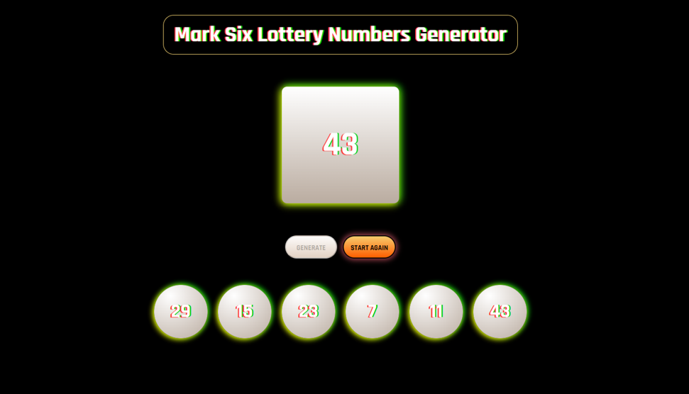

# Mark Six Lottery Numbers Generator (React)

Mark Six is a lottery game organized by the Hong Kong Jockey Club.
This programme helps players to generate 6 unique numbers for the game.

# Tech Stack

HTML, CSS, JavaScript, React.js

# Getting Started

1. Fork this project.

2. Clone the repository:

```
git clone https://github.com/kendicey/mark-six-lottery-numbers-generator-REACT.git
```

3. Install dependencies:

```
npm i
```

4. Ready to run:

```
npm start
```
